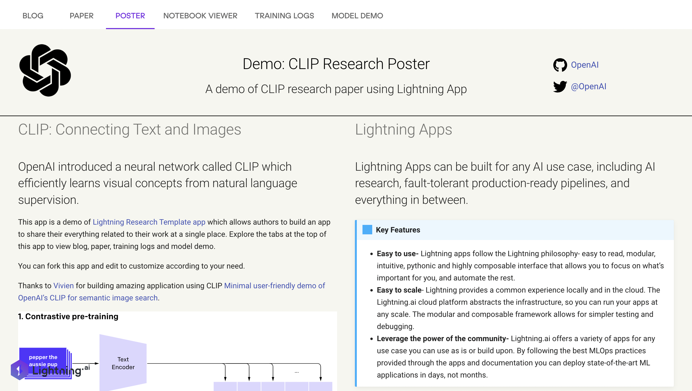

# ⚡️ SpiderMan Universe Finder (using FaceNet)🔬

SpiderMan Universe Finder based on FaceNet (A Unified Embedding for Face Recognition and Clustering)

FaceNet achieved a record new `99.63%` accuracy on the widely used Labeled Faces in the Wild (LFW) dataset.

This app is a research poster demo of FaceNet paper. It showcases paper, a notebook, a blog, and a model demo where you
can upload photos of Peter Parker (SpiderMan) from any universe and show you their bio.
To create a research poster for your work please
use [Lightning Research Template app](https://github.com/PyTorchLightning/lightning-template-research-app).

## Getting started

To create a Research Poster you can install this app via the [Lightning CLI](https://lightning.ai/lightning-docs/) or
[use the template](https://docs.github.com/en/articles/creating-a-repository-from-a-template) from GitHub and
manually install the app as mentioned below.

### Installation

#### With Lightning CLI

`lightning install app lightning/spiderman-finder`

#### Use GitHub template

Click on the "Use this template" button at the top, name your app repo, and GitHub will create a fork of this app to
your account.

> 


Once you have installed the app, you can goto the `research-poster-facenet` folder and
run `lightning run app app.py --cloud` from terminal.
This will launch the template app in your default browser with tabs containing research paper, blog, Training
logs, and Model Demo.

You should see something like this in your browser:

> 

You can modify the content of this app and customize it to your research.
At the root of this template, you will find [app.py](./app.py) that contains the `ResearchApp` class. This class
provides arguments like a link to a paper, a blog, and whether to launch a Gradio demo. You can read more about what
each of the arguments does in the docstrings.

### Highlights

- Provide the link for paper, blog, or training logger like WandB as an argument, and `ResearchApp` will create a tab
  for each.
- Make a poster for your research by editing the markdown file in the [resources](./resources/poster.md) folder.
- Add interactive model demo with Gradio app, update the gradio component present in the \[research_app (
  ./research_app/components/model_demo.py) folder.
- View a Jupyter Notebook or launch a fully-fledged notebook instance (Sharing a Jupyter Notebook instance can expose
  the cloud instance to security vulnerability.)
- Reorder the tab layout using the `tab_order` argument.

### Example

```python
# update app.py at the root of the repo
import lightning as L

poster_dir = "resources"
paper = "https://arxiv.org/pdf/1503.03832"
blog = "https://aniketmaurya.com/tensorflow/face%20recognition/2019/01/07/face-recognition.html"
github = "https://github.com/timesler/facenet-pytorch"

app = L.LightningApp(
    ResearchApp(
        poster_dir=poster_dir,
        paper=paper,
        blog=blog,
        github=github,
        notebook_path="resources/infer.ipynb",
        launch_gradio=True,
    ),
)
```

## FAQs

1. How to pull from the latest template
   code? [Answer](https://stackoverflow.com/questions/56577184/github-pull-changes-from-a-template-repository)
